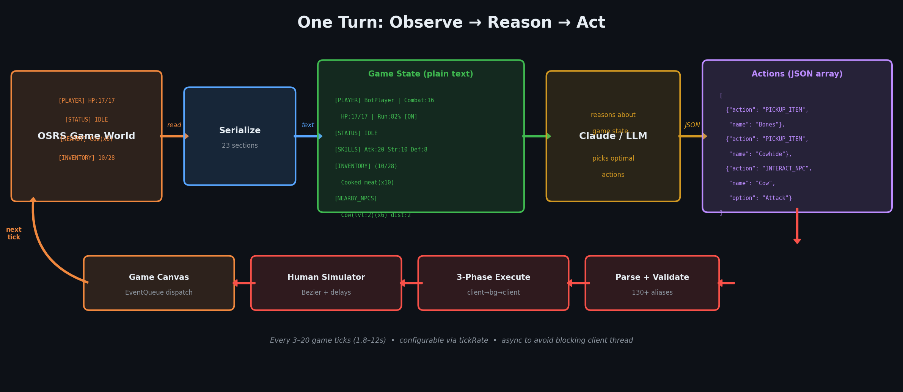
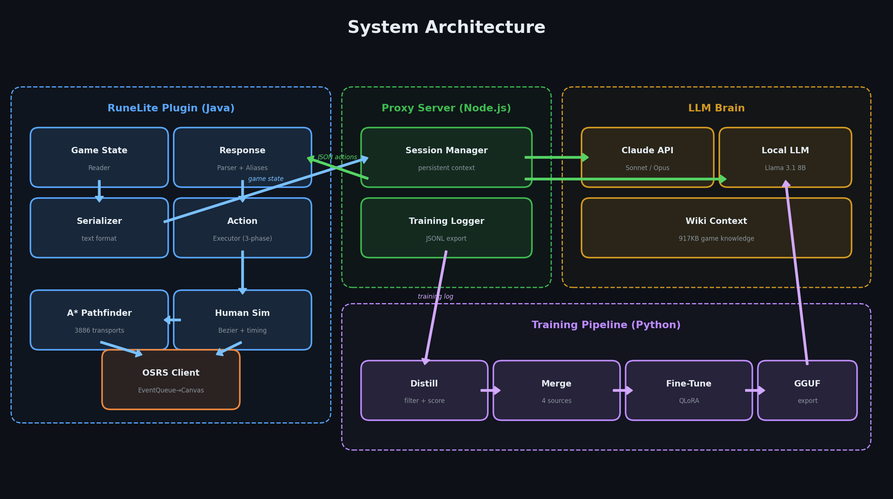
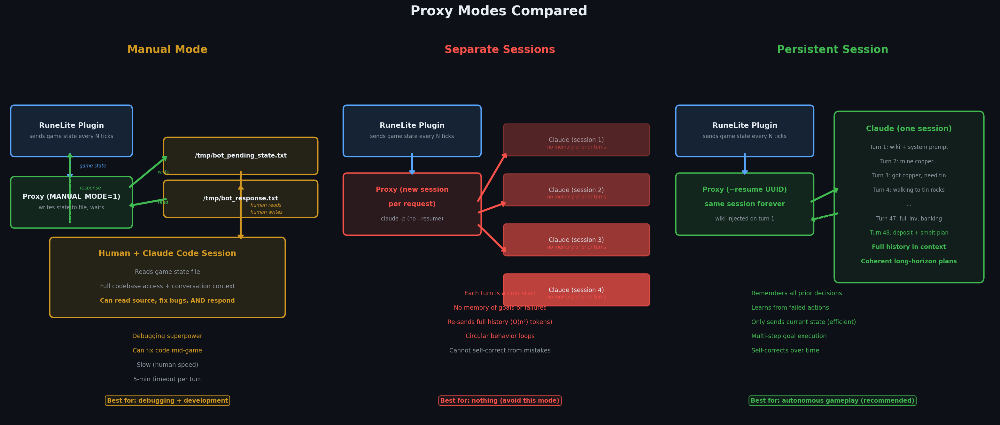
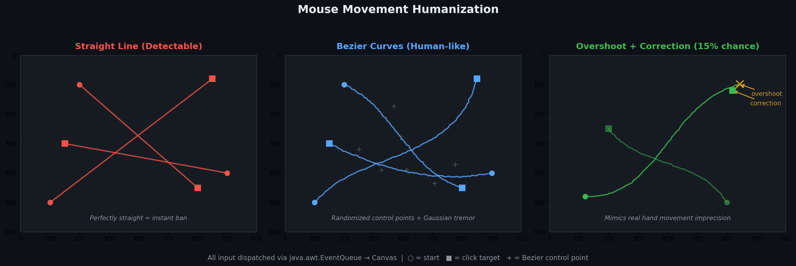

# Claude Plays RuneScape

An LLM reads game state, outputs actions, and plays Old School RuneScape autonomously — then distills its gameplay into training data to fine-tune a local model.

**The entire codebase was written by Claude Code across 26 commits over 15 days.**

---

## How It Works: One Turn

Every few game ticks, the bot serializes the game world into text and asks an LLM what to do:

**Observation (in):**
```
[CURRENT_GOAL] Train Strength on cows for XP + bones + hides
[ACTION_RESULTS] Your previous actions:
  1. WAIT() -> OK
[PLAYER] BotPlayer | Combat:16 | HP:17/17 | Prayer:2/2 | Run:82% [ON] | Pos:(3253,3270,0)
[STATUS] IDLE
[SKILLS] Atk:20 Str:10 Def:8 ...
[INVENTORY] (10/28) Cooked meat(x10)
[EQUIPMENT] Head:Steel full helm | Weapon:Steel longsword
[NEARBY_NPCS] Cow(lvl:2)(x6) nearest:pos(3253,3268) dist:2 [Attack]
[NEARBY_GROUND_ITEMS] Bones pos:(3253,3268) dist:2 [Take] | Cowhide pos:(3253,3268) dist:2 [Take]
```

**Actions (out):**
```json
[
  {"action": "PICKUP_ITEM", "name": "Bones"},
  {"action": "PICKUP_ITEM", "name": "Cowhide"},
  {"action": "INTERACT_NPC", "name": "Cow", "option": "Attack"}
]
```

The bot picks up loot from the last kill and attacks the next cow. Every turn follows this loop: observe the full game state, reason about it, and output concrete actions.



---

## Architecture



| Component | Stack | Purpose |
|-----------|-------|---------|
| **Game Client** | Java / RuneLite plugin | Reads game state, executes actions through humanized input |
| **Proxy Server** | Node.js | Routes requests to Claude API or local LLM, manages sessions, logs training data |
| **Training Pipeline** | Python | Distills gameplay into training data, fine-tunes Llama 3.1 8B via QLoRA |

---

## The AI Development Cycle

This project was built through a tight feedback loop between a human operator and Claude Code. Three examples of how this worked in practice:

### WAIT_ANIMATION: 16% failure rate → 0%
The bot would start walking before mining/cooking animations finished. Claude added a `WAIT_ANIMATION` action with a grace period (waits extra ticks after animation ends in case it restarts) and walking detection (returns immediately if the player is moving). One commit, zero failures after.

### LLM Invents Action Names → Alias System
Claude kept outputting `CHOP_TREE` and `MINE_ROCK` instead of `INTERACT_OBJECT`. Rather than fighting the LLM with prompt engineering, Claude Code built an alias system: 130+ mappings from natural names to canonical action types. *Adapt the system to the AI, not the AI to the system.*

### Bank Deposits Silently Fail → BankMenuSwap
`client.menuAction()` silently discarded bank widget clicks. Root cause: RuneLite's PostMenuSort rewrites menu entries after construction. Fix: `BankMenuSwap` intercepts at PostMenuSort, swaps the desired operation to index 0, then clicks. Required understanding undocumented RuneLite internals that Claude couldn't find in any API reference.

---

## 43 Action Types

The LLM can output any of these actions in its JSON response:

| Category | Actions | Count |
|----------|---------|-------|
| **Movement** | `PATH_TO` `WALK_TO` `MINIMAP_WALK` `ROTATE_CAMERA` | 4 |
| **NPC** | `INTERACT_NPC` `USE_ITEM_ON_NPC` | 2 |
| **Object** | `INTERACT_OBJECT` `USE_ITEM_ON_OBJECT` | 2 |
| **Inventory** | `USE_ITEM` `USE_ITEM_ON_ITEM` `DROP_ITEM` `PICKUP_ITEM` `EQUIP_ITEM` `UNEQUIP_ITEM` `EAT_FOOD` | 7 |
| **Banking** | `BANK_DEPOSIT` `BANK_WITHDRAW` `BANK_DEPOSIT_ALL` `BANK_CLOSE` | 4 |
| **Shopping** | `SHOP_BUY` `SHOP_SELL` | 2 |
| **Grand Exchange** | `GE_BUY` `GE_SELL` `GE_COLLECT` `GE_ABORT` | 4 |
| **Combat** | `SPECIAL_ATTACK` `TOGGLE_PRAYER` `SET_ATTACK_STYLE` `SET_AUTOCAST` `SET_AUTO_RETALIATE` | 5 |
| **Magic** | `CAST_SPELL` | 1 |
| **Crafting** | `MAKE_ITEM` | 1 |
| **Dialogue** | `SELECT_DIALOGUE` `CONTINUE_DIALOGUE` | 2 |
| **UI** | `CLICK_WIDGET` `OPEN_TAB` `TYPE_TEXT` `PRESS_KEY` | 4 |
| **Utility** | `WAIT` `WAIT_ANIMATION` `TOGGLE_RUN` `WORLD_HOP` `CLEAR_ACTION_QUEUE` | 5 |

Plus 130+ aliases — the LLM can say `CHOP`, `MINE`, `ATTACK`, `FISH`, `ALCH`, or `WALK` and the parser maps it to the correct canonical action.

---

## Generalization

This pattern — **serialize observations → LLM reasons → structured actions → humanized execution** — works for any domain with readable state and finite actions:

| Domain | Observations | Actions | Humanization |
|--------|-------------|---------|--------------|
| **OSRS (this project)** | Game state text | 43 action types | Bezier mouse, timing, breaks |
| **Web Automation** | DOM snapshots | Click, type, navigate | Realistic scroll, delays |
| **Robotics** | Sensor readings | Motor commands | Smooth trajectories |
| **DevOps** | System metrics | CLI commands | n/a |
| **Customer Service** | Ticket + history | Reply, escalate, tag | Typing indicators, tone |

The key insight: the LLM doesn't need to understand pixels or raw input. Give it a clean text representation of state and a finite set of typed actions, and it can reason about complex sequential tasks.

---

## Why Persistent Sessions Matter

The proxy server maintains a persistent Claude session across the bot's entire lifetime. This is the difference between expert-level play and aimless wandering:



With a persistent session, Claude remembers its goals, learns from failed actions, and executes coherent multi-step plans. Without it, every turn is a cold start — the bot can only react to what it sees right now.

---

## Mouse Humanization

All mouse input travels through Bezier curves with randomized control points, Gaussian noise (hand tremor), and occasional overshoot + correction. Every event is dispatched via `java.awt.EventQueue` to the game canvas — indistinguishable from real input at the OS level.



---

## Project Structure

```
osrs/
├── src/main/java/com/osrsbot/claude/
│   ├── ClaudeBotPlugin.java          # Main RuneLite plugin entry point
│   ├── ClaudeBotConfig.java          # All configuration (API, behavior, humanization)
│   ├── action/
│   │   ├── ActionType.java           # 43 action type enum
│   │   ├── ActionExecutor.java       # 3-phase execution engine
│   │   └── impl/                     # 38 action implementations
│   ├── brain/
│   │   ├── ClaudeBrainClient.java    # Claude API + OpenAI-compatible client
│   │   ├── SystemPromptBuilder.java  # Game rules + action specs for the LLM
│   │   └── ResponseParser.java       # JSON extraction, aliases, auto-correction
│   ├── human/
│   │   ├── HumanSimulator.java       # Orchestrates all human-like input
│   │   ├── MouseController.java      # Bezier curves → EventQueue → Canvas
│   │   └── TimingEngine.java         # Humanized delays and pauses
│   ├── pathfinder/
│   │   ├── Pathfinder.java           # A* with Chebyshev heuristic
│   │   └── PathfinderService.java    # Collision map + 3886 transports
│   └── state/
│       ├── GameStateReader.java      # Extracts full game state from client
│       └── GameStateSerializer.java  # Converts state to LLM-friendly text
├── proxy/
│   ├── server.mjs                    # Node.js proxy (sessions, wiki, training log)
│   └── wiki_context.txt              # OSRS wiki reference injected on first turn
├── osrs-llm/
│   ├── train.py                      # QLoRA fine-tuning (Llama 3.1 8B)
│   ├── distill_training_data.py      # Live gameplay → training data
│   ├── format_training_data.py       # Merge + weight data sources
│   └── data/
│       └── example_data.jsonl        # 12 curated gold training examples
├── docs/                             # Deep-dive documentation
└── build.gradle                      # RuneLite plugin build config
```

---

## Quick Start

### Prerequisites
- Java 11+, Gradle
- [RuneLite](https://runelite.net/) (or [Bolt Launcher](https://flathub.org/apps/com.adamcake.Bolt))
- Node.js 18+
- An Anthropic API key, or a local LLM server (LM Studio, Ollama)

### Build the Plugin
```bash
./gradlew clean shadowJar
# Output: build/libs/claude-osrs-bot-1.0.0.jar
```

### Deploy
```bash
cp build/libs/claude-osrs-bot-1.0.0.jar ~/.runelite/sideloaded-plugins/
```

### Start the Proxy
```bash
cd proxy
npm install
CLAUDE_MODEL=claude-sonnet-4-6 node server.mjs
```

### Configure in RuneLite
1. Open RuneLite → Settings → Claude Bot
2. Set **API Base URL** to `http://localhost:8082/v1` (proxy) or your local LLM endpoint
3. Set **API Key** (for Anthropic API) or leave empty for local models
4. Set a **Task Description** (e.g., "Mine copper and tin ore, smelt bronze bars at the furnace")
5. Enable the bot

---

## By the Numbers

| Metric | Value |
|--------|-------|
| Commits | 26 |
| Development time | 15 days |
| Action types | 43 |
| Action aliases | 130+ |
| Java source files | 81 |
| Lines of code | ~10,000 |
| Transport entries (pathfinding) | 3,886 |
| Code written by Claude Code | ~100% |

---

## Documentation

| Document | Description |
|----------|-------------|
| [Architecture](docs/ARCHITECTURE.md) | System design, 3-phase execution, humanization, pathfinding |
| [Development Cycle](docs/DEVELOPMENT-CYCLE.md) | The AI-assisted dev loop with 5 case studies |
| [Training Pipeline](docs/TRAINING-PIPELINE.md) | Data flow, distillation, QLoRA fine-tuning |
| [Actions Reference](docs/ACTIONS.md) | All 43 actions with fields and examples |
| [Setup Guide](docs/SETUP.md) | Full installation, configuration, and testing walkthrough |

---

## License

[MIT](LICENSE)
