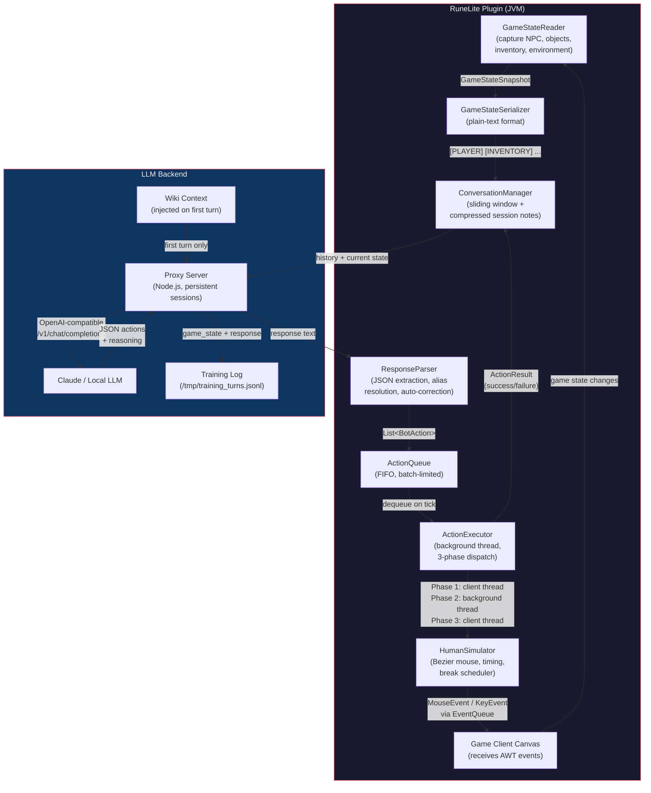
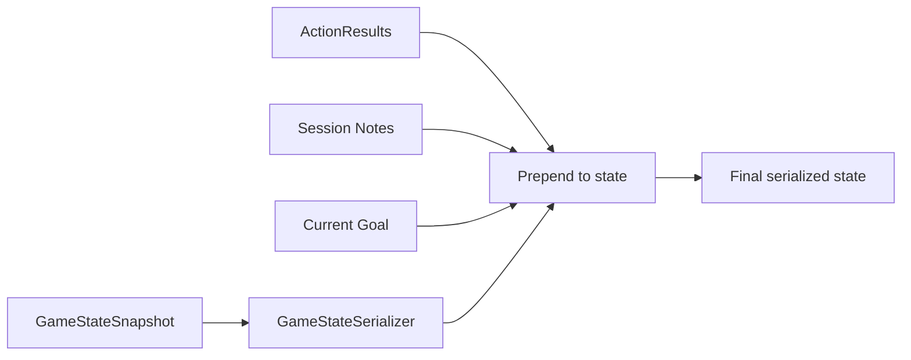
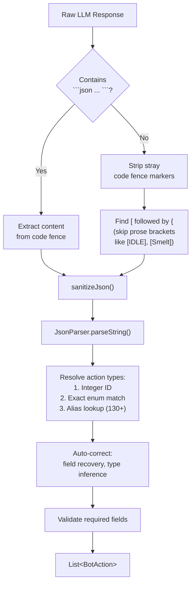
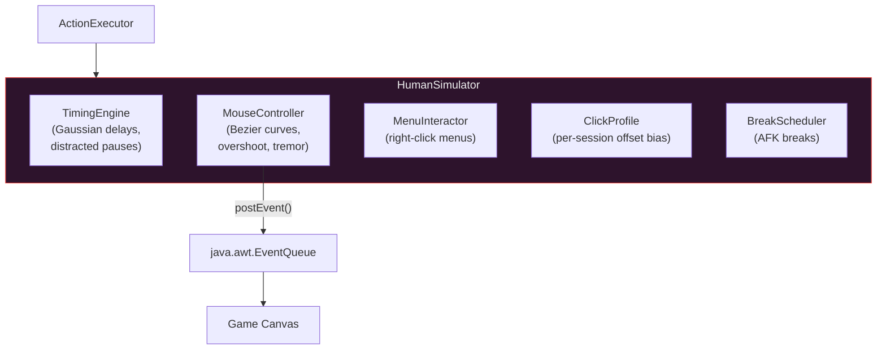
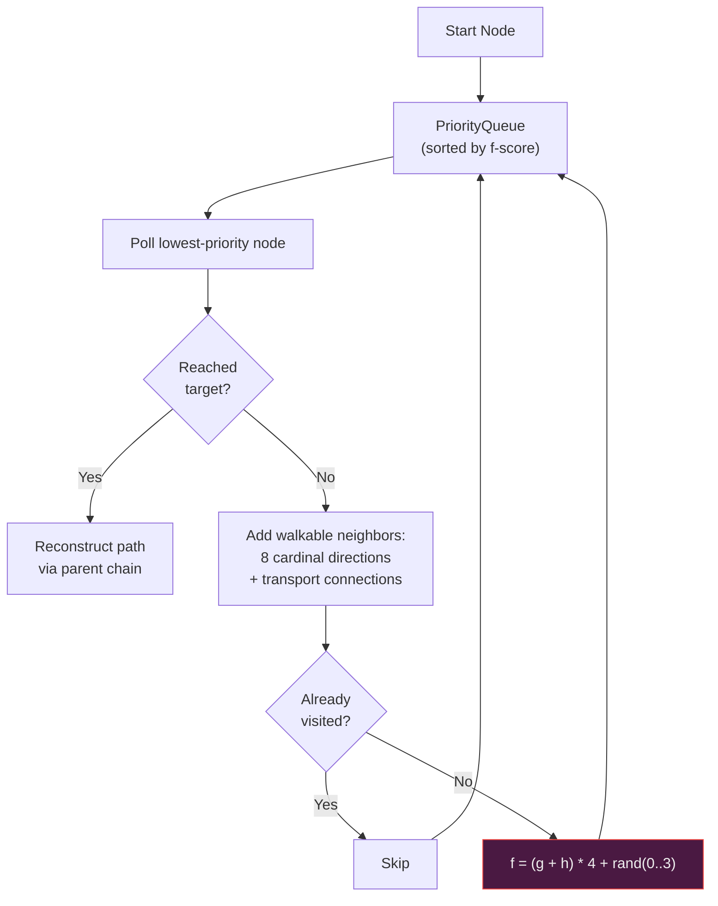
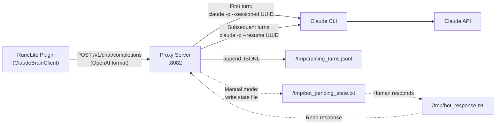
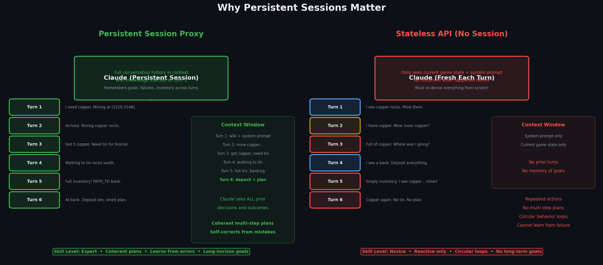

# Architecture

Technical architecture of **Claude Plays RuneScape** -- an Old School RuneScape bot where a large language model reads serialized game state and outputs JSON actions that are executed through a humanized input pipeline.

---

## Table of Contents

1. [System Overview](#1-system-overview)
2. [The 3-Phase Action Pattern](#2-the-3-phase-action-pattern)
3. [Game State Serialization](#3-game-state-serialization)
4. [Response Parsing](#4-response-parsing)
5. [Humanization Layer](#5-humanization-layer)
6. [A* Pathfinding](#6-a-pathfinding)
7. [Proxy Server](#7-proxy-server)

---

## 1. System Overview


The system forms a closed loop: the game client produces state, the LLM decides what to do, and the action executor carries it out through humanized input, feeding results back into the next state capture.



### Data Flow Summary

| Step | Component | Thread | Description |
|------|-----------|--------|-------------|
| 1 | `GameStateReader` | Client | Captures snapshot of all game state on every tick cycle |
| 2 | `GameStateSerializer` | Client | Converts snapshot to token-efficient plain text |
| 3 | `ConversationManager` | Client | Builds message history (recent full exchanges + compressed session notes) |
| 4 | `ClaudeBrainClient` | Background | Sends state to LLM via Anthropic SDK or OpenAI-compatible HTTP |
| 5 | `ResponseParser` | Background | Extracts JSON actions from LLM response, resolves aliases, auto-corrects |
| 6 | `ActionQueue` | Background | Enqueues parsed actions up to configurable batch limit |
| 7 | `ActionExecutor` | Background | Dequeues one action per tick, dispatches to the 3-phase execution model |
| 8 | `HumanSimulator` | Background | Moves mouse along Bezier curves, dispatches events to canvas |
| 9 | Game Client | EDT | Processes synthetic AWT events as if they came from real hardware |

### Training Data Feedback Loop

Every LLM turn is logged as a JSONL entry to `/tmp/training_turns.jsonl`:

```json
{
  "turn": 47,
  "ts": "2026-03-02T14:23:01.000Z",
  "session": "a1b2c3d4-...",
  "game_state": "[PLAYER] PlayerName | Combat:30 | HP:25/30 ...",
  "response": "[{\"action\":\"EAT_FOOD\",\"name\":\"Lobster\"}]",
  "latency_ms": 2340
}
```

Session boundaries are also logged, creating a complete dataset for fine-tuning smaller models on Claude's decision-making traces.

---

## 2. The 3-Phase Action Pattern

This is the single most important architectural concept in the system. Every action that interacts with the game follows a strict three-phase execution model.

### Why Three Phases?

The OSRS client (running inside RuneLite) is **single-threaded**. All game rendering, NPC movement, widget updates, and API calls happen on one thread -- the client thread. If you block it (e.g., with `Thread.sleep()` during a Bezier mouse curve), the game freezes visibly. But you cannot call OSRS API methods like `client.getObjectDefinition()` or `NPC.getName()` from a background thread either -- they assert client-thread ownership and throw.

The solution: split every action into three phases that alternate between the client thread and a background thread.

```mermaid
sequenceDiagram
    participant CT as Client Thread
    participant BG as Background Thread (ActionExecutor)
    participant EQ as AWT EventQueue
    participant GC as Game Canvas

    Note over BG: Action dequeued from ActionQueue

    rect rgb(40, 60, 80)
        Note over CT,BG: Phase 1 - Client Thread (API Lookups)
        BG->>CT: ClientThreadRunner.runOnClientThread()
        CT->>CT: Find NPC/Object, get clickbox,<br/>read widget, build menu params
        CT-->>BG: Return lookup data<br/>(CompletableFuture)
    end

    rect rgb(60, 40, 60)
        Note over BG,GC: Phase 2 - Background Thread (Humanized Input)
        BG->>BG: HumanSimulator.moveMouse(x, y)
        BG->>EQ: MOUSE_MOVED events (Bezier curve)
        EQ->>GC: Dispatched to canvas
        BG->>BG: shortPause() — humanized delay
    end

    rect rgb(40, 60, 80)
        Note over CT,GC: Phase 3 - Client Thread (Game Interaction)
        BG->>CT: clientThread.invokeLater()
        CT->>CT: client.menuAction(...)<br/>fire-and-forget
    end

    Note over BG: TimingEngine.nextActionDelay()<br/>before next action
```



### Phase 1: Client Thread -- API Lookups

All OSRS client API calls happen here. The background thread blocks via `CompletableFuture` (with a 10-second timeout) while the client thread executes the lookup:

```java
// ClientThreadRunner.java -- blocks the background thread safely
public static <T> T runOnClientThread(ClientThread clientThread, Callable<T> task) {
    CompletableFuture<T> future = new CompletableFuture<>();
    clientThread.invokeLater(() -> {
        try {
            future.complete(task.call());
        } catch (Throwable t) {
            future.completeExceptionally(t);
        }
    });
    return future.get(10, TimeUnit.SECONDS);
}
```

Typical Phase 1 work:
- `objectUtils.findNearest()` -- scene traversal to find the target object
- `client.getObjectDefinition()` -- get the object's actions, impostor resolution
- `obj.getClickbox().getBounds()` -- screen-space coordinates for the mouse
- `npc.getCanvasTilePoly()` -- NPC clickable area
- Widget lookups for inventory slots, spell icons, bank items

### Phase 2: Background Thread -- Humanized Input

With lookup data in hand, the background thread generates realistic mouse and keyboard input. This is where all `Thread.sleep()` calls happen -- the background thread can sleep freely without affecting the game.

```java
// Phase 2 in InteractObjectAction.java
if (screenPoint != null) {
    human.moveMouse(screenPoint.x, screenPoint.y);  // Bezier curve, 20-300ms
    human.shortPause();                               // 200-600ms gaussian delay
}
```

The mouse movement dispatches `MOUSE_MOVED` events through the AWT EventQueue to the game canvas (see [Humanization Layer](#5-humanization-layer) for details).

### Phase 3: Client Thread -- Game Interaction

The actual game action is fired as a `client.menuAction()` call on the client thread. This is **fire-and-forget** -- it returns immediately and the game processes the action on its next tick.

```java
// Phase 3 in InteractObjectAction.java
clientThread.invokeLater(() -> {
    // Try to use real menu entries first (correct object ID for overlapping objects)
    MenuEntry[] entries = client.getMenuEntries();
    MenuEntry match = findMatchingEntry(entries, option, objName);

    if (match != null) {
        client.menuAction(match.getParam0(), match.getParam1(),
            match.getType(), match.getIdentifier(), -1,
            match.getOption(), match.getTarget());
    } else {
        // Fallback: use constructed menu action
        client.menuAction(sceneX, sceneY, menuAction, objId, -1, option, objName);
    }
});
```

Phase 3 preferentially uses the game's real menu entries (which contain the correct object ID for overlapping objects like staircases) with a fallback to the constructed action from Phase 1.

### Failure Handling

When any phase fails, the ActionExecutor automatically clears the remaining action queue. This ensures Claude gets fresh state on the next turn instead of executing stale actions based on outdated assumptions:

```java
if (!lastResult.isSuccess()) {
    int cleared = actionQueue.size();
    if (cleared > 0) {
        actionQueue.clear();
    }
}
```

The failure message propagates back to Claude as `[ACTION_RESULTS]` in the next game state, enabling it to re-plan.

---

## 3. Game State Serialization

### Design Choice: Plain Text Over JSON

Game state is serialized as **labeled plain text**, not JSON. This was a deliberate choice for token efficiency. A JSON representation of the same state would consume roughly 2-3x more tokens due to key quoting, braces, brackets, and structural overhead. Since the LLM processes this on every turn (every 3-5 game ticks), token savings compound massively over a session.

### Serialization Pipeline



`GameStateReader` captures a `GameStateSnapshot` on the client thread (all API calls happen there), then `GameStateSerializer` converts it to text. The plugin prepends additional context sections before sending to the LLM.

### Annotated Example

```
[SESSION_NOTES] Summary of earlier activity:
- @(3253,3270) IDLE inv:14/28 -> INTERACT_NPC(Cow),WAIT_ANIMATION(30t)
- @(3253,3271) ANIMATING inv:14/28 -> PICKUP_ITEM(Cowhide),PICKUP_ITEM(Bones)

[CURRENT_GOAL] Train combat on cows, collect hides and bones

[ACTION_RESULTS] Your previous actions:
  1. INTERACT_NPC(name=Cow,option=Attack) -> OK
  2. WAIT_ANIMATION() -> OK: Animation complete after 12 ticks

[PLAYER] IronClaude | Combat:15 | HP:22/26 | Prayer:15/15 | Run:78% [ON] | Weight:12kg | SpecAtk:100% | Pos:(3253,3271,0)
[STATUS] IDLE
[SKILLS] Atk:12 Str:10 Def:8 Rng:1 Mag:1 WC:15 Mine:10 Fish:5 Cook:5 FM:1 Craft:1 Smith:1 Fletch:1 Slay:1 Farm:1 Con:1 Hunt:1 Agi:1 Thiev:1 Herb:1 RC:1
[XP] Atk:1358/1584(85%) Str:1154/1358(85%) Def:801/969(82%) HP:1833/2107(86%)
[INVENTORY] (16/28) Cowhide(x4) | Bones(x6) | Bronze sword(x1) | Wooden shield(x1) | Shrimps(x4)
[EQUIPMENT] Head:Bronze med helm | Body:Leather body | Legs:Bronze platelegs | Weapon:Bronze sword | Shield:Wooden shield
[NEARBY_NPCS] Cow(lvl:2)(x4) [Attack] *@(3255,3273):3 @(3251,3268):4 @(3258,3275):6 @(3249,3265):8 | Cow calf(x2) [Attack] *@(3257,3269):5
[NEARBY_OBJECTS] Gate [Open] *@(3253,3264):7 | Large door [Open] *@(3246,3265):9
[NEARBY_GROUND_ITEMS] Bones *@(3253,3271):0 | Cowhide *@(3253,3271):0 | Raw beef *@(3255,3270):3
[NEARBY_PLAYERS] SomePlayer123 *@(3257,3274):6
[ENVIRONMENT] Region:Lumbridge(12850) Plane:0 World:301 Tab:Inventory Style:Accurate AutoRet:ON Spellbook:Standard QP:0 Tick:48231
```

### Section Reference

| Section | Always Present | Description |
|---------|:-:|-------------|
| `[PLAYER]` | Yes | Name, combat level, HP, prayer, run energy, weight, spec attack, world position |
| `[STATUS]` | Yes | `IDLE`, `MOVING dest:(x,y)`, `IN_COMBAT`, `ANIMATING(id)`, or `STUCK(N ticks)` |
| `[SKILLS]` | Yes | All 23 skill levels, abbreviated |
| `[XP]` | Yes | XP progress toward next level with percentage (non-zero skills only) |
| `[BOOSTED]` | Conditional | Shown only when boosted/drained levels differ from base (potions, stat drains) |
| `[INVENTORY]` | Yes | Used slots count, items grouped by name with quantities |
| `[EQUIPMENT]` | Yes | Equipped items by slot |
| `[NEARBY_NPCS]` | Conditional | Top 15 nearest NPCs, grouped by name, with actions, positions, distances, health |
| `[NEARBY_OBJECTS]` | Conditional | Top 15 nearest objects with actions and positions |
| `[NEARBY_GROUND_ITEMS]` | Conditional | Ground items with positions and distances |
| `[NEARBY_PLAYERS]` | Conditional | Other players nearby |
| `[ENVIRONMENT]` | Yes | Region, plane, world, active tab, attack style, auto-retaliate, spellbook, quest points, interface flags |
| `[BANK_CONTENTS]` | Conditional | When bank is open (limited to 40 items to save tokens) |
| `[SHOP_CONTENTS]` | Conditional | When shop is open |
| `[GE_OFFERS]` | Conditional | Grand Exchange offer status |
| `[MAKE_OPTIONS]` | Conditional | When make/craft/smelt interface is open |
| `[DIALOGUE]` | Conditional | Dialogue type, speaker, text, and available options |
| `[UNDER_ATTACK]` | Conditional | NPCs currently targeting the player |
| `[HINT_ARROW]` | Conditional | Tutorial/quest hint arrows with coordinates |
| `[INSTRUCTION]` | Conditional | Tutorial overlay instruction text |
| `[GAME_MESSAGES]` | Conditional | Recent game chat messages (failures, instructions) |
| `[ACTIVE_PRAYERS]` | Conditional | Currently active prayers |
| `[SLAYER_TASK]` | Conditional | Active slayer assignment |
| `[ACTION_RESULTS]` | Conditional | Success/failure of previous action batch |
| `[CURRENT_GOAL]` | Conditional | Persistent goal set by the LLM |
| `[SESSION_NOTES]` | Conditional | Compressed summaries of older exchanges |
| `[USER_NUDGE]` | Conditional | One-time human override instruction |

### Nearby Entity Format

Entities are deduplicated and grouped for token efficiency:

```
Name(lvl:N)(xCount) [Action1,Action2] *@(x,y):dist @(x,y):dist ...
```

- `*@` marks the nearest instance
- Up to 5 positions shown per entity type
- Health percentage shown when entity is damaged
- Quantity suffix for stacked ground items

---

## 4. Response Parsing

`ResponseParser` is the most forgiving component in the system. LLMs -- especially smaller local models -- produce wildly inconsistent JSON. The parser must handle everything from perfectly formatted arrays to reasoning-heavy prose with embedded code fences and invented action names.

### JSON Extraction Pipeline



### JSON Sanitization

The `sanitizeJson()` method fixes common LLM malformations before parsing:

| Issue | Example | Fix |
|-------|---------|-----|
| Trailing quote on numbers | `"y":3305"` | `"y":3305` |
| Trailing quote on booleans | `"flag":true"` | `"flag":true` |
| Trailing commas | `[1, 2, ]` | `[1, 2]` |
| Missing comma between objects | `}{` | `},{` |
| Single-quoted JSON | `{'action':'WAIT'}` | `{"action":"WAIT"}` |

### Action Alias Resolution (130+ Mappings)

LLMs invent natural-language action names. The parser maps them to real `ActionType` values with sensible defaults:

```
CHOP, CUT, CUT_DOWN        -> INTERACT_OBJECT  option="Chop down"
MINE, MINING                -> INTERACT_OBJECT  option="Mine"
ATTACK, FIGHT               -> INTERACT_NPC     option="Attack"
TALK, TALK_TO               -> INTERACT_NPC     option="Talk-to"
ALCH, HIGH_ALCH             -> CAST_SPELL       name="High Level Alchemy"
FIRE_STRIKE                 -> CAST_SPELL       name="Fire Strike"
PROTECT_MELEE               -> TOGGLE_PRAYER    name="Protect from Melee"
SMELT_BRONZE                -> MAKE_ITEM        name="Bronze bar"
CLOSE_SHOP, EXIT_INTERFACE  -> PRESS_KEY        name="escape"
DEPOSIT, WITHDRAW           -> BANK_DEPOSIT / BANK_WITHDRAW
```

When an alias provides a `defaultName` (like `"Fire Strike"` for the `FIRE_STRIKE` alias) and the LLM puts a target in the `name` field instead, the parser auto-corrects by moving the target to the appropriate field:

```json
// LLM writes:
{"action": "FIRE_STRIKE", "name": "Goblin"}

// Parser auto-corrects to:
{"action": "CAST_SPELL", "name": "Fire Strike", "npc": "Goblin"}
```

### Auto-Correction: Type Inference

When the LLM uses the wrong integer action ID but the fields clearly indicate a different action, `inferCorrectType()` fixes it. This catches a class of errors where local models confuse nearby integer IDs:

| Parsed As | Fields Present | Corrected To | Reason |
|-----------|---------------|--------------|--------|
| `SELECT_DIALOGUE(14)` | item + quantity, no x/y | `BANK_WITHDRAW(19)` | ID confusion |
| `BANK_CLOSE(20)` | item + quantity, no x/y | `BANK_DEPOSIT(18)` | Adjacent IDs |
| `USE_ITEM(4)` | x/y only, no item/option | `PATH_TO(38)` | Coordinate-based action |

### Idle Loop Detection

If the LLM outputs 3 or more consecutive all-WAIT responses (no real actions), the parser injects an escalating error message:

```
IDLE_LOOP: You have been WAITing for 5 consecutive turns doing NOTHING.
This is NOT acceptable. Rule 18: NEVER declare your task complete or stop working.
Look at your surroundings and DO something.
```

### Terminal Goal Rejection

Small models frequently declare victory and idle. The parser detects terminal goal patterns and rejects them:

```
// Rejected goals:
"Task complete"           // past-tense "complete" not at start
"Session done"            // "done" not at start
"Nothing left to do"      // explicit terminal phrases

// Allowed goals:
"Complete Cook's Assistant quest"   // "Complete" at start = imperative verb
"Finish mining iron ore"            // "Finish" at start = imperative verb
```

### Format Correction Retry

If the LLM's response fails basic structural validation (no `"action"` field, no JSON array markers), `ClaudeBrainClient` sends the original exchange plus a detailed `FORMAT_CORRECTION` prompt listing every valid action with examples. This gives the LLM a second chance to produce valid output before falling back to WAIT.

---

## 5. Humanization Layer

All input to the game client flows through the humanization layer. No action ever calls client APIs directly for clicks or keypresses. The game must see realistic mouse curves, natural timing, and plausible keyboard input.


### Architecture



### MouseController: Bezier Curves

Mouse movement follows **cubic Bezier curves** with randomized control points, simulating the natural arc of a hand moving a mouse.

**Curve Generation:**
1. Two control points are placed at ~1/3 and ~2/3 along the line from start to target
2. Each control point is offset perpendicular to the line by a random amount scaled to distance (20-60% of distance)
3. Points along the curve are evaluated with an **ease-in-out** function: slow start, fast middle, slow end
4. Per-point Gaussian noise (sigma=0.8px) simulates hand tremor on all points except the final one

**Movement Parameters:**

| Parameter | Value | Description |
|-----------|-------|-------------|
| Steps (short, <100px) | 8-20 | Fewer steps for close targets |
| Steps (long, >100px) | 20-80 | More steps for distant targets |
| Overshoot chance | 15% | Mouse overshoots target, then corrects |
| Overshoot distance | 3-8px | How far past the target |
| Correction steps | 3-7 | Steps to correct back from overshoot |
| Step delay | 1-6ms | Time between MOUSE_MOVED events |

**Overshoot Behavior:** For movements longer than 50px, there is a 15% chance the cursor overshoots the target by 3-8 pixels along the movement direction, pauses 20-60ms, then corrects back. This mimics the real behavior of mouse users slightly overshooting clickable targets.

### Event Dispatch

All events are posted to the system EventQueue via `canvas.getToolkit().getSystemEventQueue().postEvent()`. This matches exactly how real hardware input flows through the JVM -- from EventQueue to EDT to `canvas.processEvent()`. The OSRS client reads input from this queue, not from direct `dispatchEvent()` calls.

```java
// MouseController.java -- the critical dispatch method
private void postEvent(AWTEvent event) {
    canvas.getToolkit().getSystemEventQueue().postEvent(event);
}
```

### Click Behavior

Clicks dispatch three events in sequence:
1. `MOUSE_PRESSED` -- button down
2. `Thread.sleep(50-150ms)` -- hold duration
3. `MOUSE_RELEASED` + `MOUSE_CLICKED` -- button up

The 50-150ms hold duration is randomized per click. Real human clicks are never instantaneous.

### Click Profile

Each session generates a `ClickProfile` with a consistent offset bias:
- 80% of clicks: offset within +/-3px of target center
- 15% of clicks: offset within +/-5px
- 5% of clicks: offset within +/-8px

This simulates how real players have slightly imprecise clicks that cluster around, but never perfectly center on, their target.

### Keyboard Input

Characters are typed as three-event sequences: `KEY_PRESSED`, `KEY_TYPED`, `KEY_RELEASED`.

| Parameter | Value | Description |
|-----------|-------|-------------|
| Key hold time | 30-90ms | Time between press and release |
| Inter-character delay | 30-120ms | Time between consecutive characters |
| Modifier keys | Separate keyDown/keyUp | For shift-click (drop items) |

### TimingEngine: Humanized Delays

All delays use a Gaussian distribution centered on the midpoint of the configured range, clamped to min/max:

| Delay Type | Range | Use Case |
|------------|-------|----------|
| Action delay | 80-300ms (configurable) | Between consecutive actions |
| Click delay | 40-120ms | Pre-click pause |
| Short pause | 200-600ms | Between action phases |
| Tick delay | 620-980ms | Between server-mutating operations (ensures full game tick) |
| Typing delay | 30-90ms | Between keystrokes |
| Distracted pause | 1000-3000ms (5% chance) | Random "looked away" moment before mouse movement |

### BreakScheduler: AFK Breaks

Simulates human break patterns to avoid detection through continuous play:

| Parameter | Default | Description |
|-----------|---------|-------------|
| Break interval | 15-45 min | Time between breaks |
| Break duration | 5-30 min | How long each break lasts |
| Enabled | Configurable | Can be toggled in plugin config |

During a break, the bot status shows "On break (Xm remaining)" and no actions are processed.

---

## 6. A* Pathfinding

The pathfinder enables navigation across the entire OSRS world map, handling doors, stairs, ladders, tunnels, and other transport connections.

### Data Sources

| Resource | Size | Description |
|----------|------|-------------|
| `collision-map.zip` | 917 KB | Pre-built directional collision flags for every tile in the game |
| `transports.txt` | 3,886 entries | Transport connections: doors, stairs, ladders, teleports, shortcuts |

The collision map stores per-tile directional flags (can move N, S, E, W, NE, NW, SE, SW) in a region-based `SplitFlagMap`. Each region is compressed individually in the zip file, identified by `regionX_regionY` filenames.

Transports are parsed from a structured text file with section headers identifying geographic areas:

```
# Lumbridge
3208 3220 2 3208 3221 1 Climb-down Staircase 16671
3208 3221 1 3208 3220 2 Climb-up Staircase 16672
3230 3212 0 3230 3212 1 Climb Ladder 16683
```

Each line: `startX startY startZ endX endY endZ action target objectId ["requirements"]`

### A* Algorithm



**Heuristic:** Chebyshev distance (`max(|dx|, |dy|)`) -- the exact optimal distance for 8-directional unit-cost movement. It is both admissible and consistent, guaranteeing optimality with a closed set.

**Anti-Detection Tiebreaker:** The f-score is scaled by 4x and a random integer in `[0, 3]` is added as a tiebreaker. Nodes with equal f-scores are explored in random order, producing different but equally-optimal paths through open areas on each invocation. The scale factor ensures the tiebreaker never changes the ordering of nodes with different f-scores, preserving optimality.

```java
int priority = (newCost + h) * PRIORITY_SCALE + random.nextInt(PRIORITY_SCALE);
```

### Transport Filtering

Transports are filtered based on the player's capabilities:

| Filter | Description |
|--------|-------------|
| F2P / Members | Separate transport maps; F2P worlds only use F2P-section transports |
| Agility level | Shortcuts with agility requirements above the player's level are excluded |
| Quest requirements | Transports behind quest gates (Ernest the Chicken, Fishing Contest, etc.) are excluded |
| Toll gates | Configurable -- `Pay-toll(10gp)` gates can be allowed or blocked |
| Grapple shortcuts | Always excluded (require specific equipment) |

### Chunked Execution

PATH_TO does not walk the entire path in one action. It walks approximately 10 tiles per call, then returns to Claude with a "tiles remaining" progress report. This design enables:

1. **Fresh state per chunk:** Claude sees updated game state (HP, inventory, attackers) between chunks and can decide to eat, fight back, or change destination
2. **Combat interrupt:** Each chunk checks for NPCs targeting the player and aborts if attacked (unless `fleeing=true`)
3. **Path caching:** Re-issuing PATH_TO with the same destination reuses the cached path, making continuation free

### Stuck Detection

Graduated response to pathfinding failures:

| Non-moves | Response |
|-----------|----------|
| 4 | Re-click the next tile on the path |
| 8 | Block a 3x3 area around the stuck position as `runtimeBlockedTiles`, invalidate cache, recompute path |

Runtime blocked tiles are cleared when the destination changes, so they do not persist across different journeys.

### Canvas vs. Minimap Walking

For close tiles (<8 distance), there is a 35% chance of clicking the game canvas viewport instead of the minimap. This is more natural -- real players click nearby visible tiles directly rather than always using the minimap.

Walk click distance is randomized between 7-14 tiles per click (minimap), mimicking how humans do not always click at maximum minimap range.

---

## 7. Proxy Server

The proxy (`proxy/server.mjs`) is a Node.js HTTP server that bridges the RuneLite plugin to Claude. It exposes an OpenAI-compatible `/v1/chat/completions` endpoint while adding session persistence, context injection, and training data logging.

### Architecture



### Persistent Sessions

The key feature of the proxy is **session persistence**. Instead of stateless one-shot API calls where the bot must send full conversation history, the proxy maintains a single Claude CLI session across the entire bot run:

- **First request:** `claude -p --session-id <uuid> --system-prompt "..."` -- creates the session
- **Subsequent requests:** `claude -p --resume <uuid>` -- continues with full context

The proxy strips conversation history from the bot's requests since Claude already remembers it from the session. Only the current game state is forwarded. This dramatically reduces token usage and avoids the O(n^2) cost of resending history.



With a persistent session, Claude remembers goals, learns from failed actions, and executes coherent multi-step plans. Without it, every turn is a cold start — the bot can only react to what it sees right now, leading to circular behavior and no long-horizon planning.

### Wiki Context Injection

On the first turn of each session, the proxy prepends the contents of `wiki_context.txt` -- a compressed OSRS wiki reference covering game mechanics, items, NPCs, locations, skills, and quests. This gives Claude comprehensive game knowledge for the entire session without the bot needing to send it every turn.

```
[OSRS_WIKI_REFERENCE]
The following is a compressed reference of the Old School RuneScape wiki.
Use this knowledge to make informed decisions about game mechanics, items, ...
<wiki content>
[/OSRS_WIKI_REFERENCE]

<actual game state>
```

### Training Data Logging

Every turn is logged to `/tmp/training_turns.jsonl` as structured JSONL:

```json
{"turn":1,"ts":"...","session":"uuid","game_state":"[PLAYER] ...","response":"[{...}]","latency_ms":2340}
{"turn":2,"ts":"...","session":"uuid","game_state":"[PLAYER] ...","response":"[{...}]","latency_ms":1890}
{"event":"session_reset","ts":"...","old_session":"...","new_session":"...","reason":"manual reset"}
```

Session boundaries are recorded so the training data can be segmented into complete episodes for fine-tuning.

### Manual Mode

Setting `MANUAL_MODE=1` enables a human-in-the-loop debugging mode:

1. The proxy writes the current game state to `/tmp/bot_pending_state.txt`
2. It blocks, polling every 500ms for a response at `/tmp/bot_response.txt`
3. A human (or a Claude Code session) reads the state, writes a JSON action array to the response file
4. The proxy picks up the response, cleans up both files, and returns it to the bot

This enables debugging specific game scenarios by manually crafting actions while the full bot infrastructure (humanized input, state capture) remains active.

### Error Handling

| Error Type | Response | Recovery |
|------------|----------|----------|
| Rate limit (429) | Exponential backoff, up to 60s | Automatic after backoff clears |
| Session error | Reset session, respond 500 | Next request creates fresh session |
| Auth error | Respond 401 | User must run `claude login` |
| Timeout | Respond 504 | Reset session if first request |
| 3+ consecutive errors | Reset session | Fresh context, clear backoff |

### Request Queue

The proxy serializes requests through a queue with max concurrency of 1. This prevents race conditions in the Claude CLI subprocess and ensures clean session state transitions. Requests that arrive while another is in-flight are queued and processed sequentially.

### Endpoints

| Method | Path | Description |
|--------|------|-------------|
| `POST` | `/v1/chat/completions` | OpenAI-compatible chat completion |
| `GET` | `/health` | Server health, session info, stats |
| `GET` | `/v1/models` | Available models |
| `POST` | `/reset` | Manual session reset |
