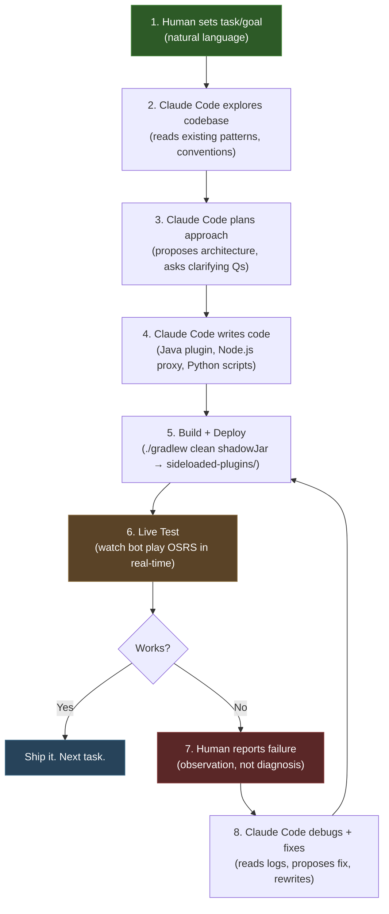

# Development Cycle: AI-Assisted Game Bot Engineering

How Claude Code wrote 81 Java files, a Node.js proxy, and Python training scripts across 26 commits in 15 days -- and what we learned about human-AI pair programming on systems that fight back.

---

## Table of Contents

- [The 8-Step Development Loop](#the-8-step-development-loop)
- [Case Study 1: WAIT_ANIMATION](#case-study-1-wait_animation)
- [Case Study 2: Action Aliases](#case-study-2-action-aliases)
- [Case Study 3: Bank Operations](#case-study-3-bank-operations)
- [Case Study 4: PATH_TO Chunked Execution](#case-study-4-path_to-chunked-execution)
- [Case Study 5: Deposit-X Dialog Detection](#case-study-5-deposit-x-dialog-detection)
- [Training Data Purge Methodology](#training-data-purge-methodology)
- [Human vs AI Roles](#human-vs-ai-roles)
- [When AI Self-Repair Works and When It Struggles](#when-ai-self-repair-works-and-when-it-struggles)

---

## The 8-Step Development Loop

Every feature in this project followed the same tight feedback loop. The human sets direction and observes the live game. Claude Code does everything else: reads the codebase, plans the implementation, writes the code, and iterates on failures until the bot works.



### Step by step

| Step | Who | What happens | Example |
|------|-----|-------------|---------|
| **1. Set goal** | Human | Describes the problem or feature in plain English | "The bot needs to wait for mining animations to finish before walking away" |
| **2. Explore** | Claude Code | Reads relevant source files, understands existing action patterns, checks how other actions handle timing | Reads `InteractObjectAction.java`, `ActionExecutor.java`, studies the 3-phase pattern |
| **3. Plan** | Claude Code | Proposes implementation approach, identifies edge cases | "I'll add WAIT_ANIMATION as action type 39, poll animation state on the client thread, with a grace period for animations that restart" |
| **4. Write** | Claude Code | Implements across all affected files: enum, action class, executor wiring, system prompt updates | Creates `WaitAnimationAction.java`, adds enum entry, registers in executor switch |
| **5. Build** | Automated | `./gradlew clean shadowJar` compiles, shadow JAR copied to `~/.runelite/sideloaded-plugins/` | 3-second build cycle |
| **6. Test** | Human | Watches the bot play. No unit tests for game interaction -- the game IS the test | Bot mines copper, animation ends, bot immediately walks to bank |
| **7. Report** | Human | Describes what went wrong, not why | "The bot walks away while still mining. It checks animation once and sees IDLE because there's a gap between the click and the animation starting" |
| **8. Fix** | Claude Code | Reads the failure, traces the logic, identifies the root cause, rewrites | Adds `START_GRACE_TICKS` -- waits up to 5 ticks for animation to begin before concluding it failed |

The critical insight: **the human never debugs code**. The human watches the game and reports what the bot did wrong in game terms. Claude Code translates that observation into a code fix. This division of labor plays to each party's strengths -- the human understands the game world, the AI understands the code.

A typical feature takes 2-4 iterations through the loop. A tricky one (bank operations) took 8+.

---

## Case Study 1: WAIT_ANIMATION

**Problem:** The bot had a 16% failure rate on skilling tasks (mining, woodcutting, fishing). It would issue `INTERACT_OBJECT` on a tree, then immediately issue `PATH_TO` for the bank -- walking away mid-chop because nothing told it to wait.

**Root cause:** The action system was fire-and-forget. `INTERACT_OBJECT` clicked the tree and returned success. The LLM's next decision arrived 2-3 seconds later, saw the player was "idle" (animation hadn't been checked), and moved on.

**Solution:** Claude Code added `WAIT_ANIMATION` (action type 39) with three key behaviors:

1. **Grace period on start:** After issuing an interact, there is a gap of 1-3 game ticks before the animation begins (the player walks to the object first). WAIT_ANIMATION waits up to 5 ticks (`START_GRACE_TICKS`) for the animation to appear. If the player is still walking (has a destination set), the grace period extends automatically.

2. **Grace period on end:** Some animations have brief gaps between cycles (e.g., between mining swings). Instead of returning immediately when animation hits IDLE, it checks if the resource was depleted or if inventory changed.

3. **Walking detection:** If the player is moving (walk/run pose animation or `getLocalDestinationLocation() != null`), WAIT_ANIMATION extends its grace deadline rather than timing out. This handles the case where the player is walking to a distant tree.

4. **Combat interrupt:** Every poll cycle checks if an NPC is targeting the player that the player did not initiate combat with. Returns immediately with attacker info so the LLM can decide to fight or flee.

5. **Resource depletion detection:** For gathering skills, tracks the last interacted game object and checks each poll if it still exists on the tile. In OSRS, depleted rocks are replaced with a different object ID, but the mining animation continues playing. The bot detects the object swap and returns early with "Rock was depleted by another player."

6. **Inventory delta tracking:** Snapshots inventory count before the animation and compares after. Reports `(inventory +1)` on success, or flags "inventory is full (28/28)" if gathering produced nothing due to a full inventory.

```java
// The core polling loop (simplified)
while (System.currentTimeMillis() < deadline) {
    int animId = getAnimation();       // client thread
    String attacker = checkAttacker(); // client thread

    if (attacker != null) return failure("Under attack by " + attacker);

    if (animId != IDLE) {
        wasAnimating = true;
        // Check if resource depleted while animating
        if (isGathering(animId) && checkObjectDepleted()) {
            return failure("Rock was depleted by another player");
        }
    } else if (wasAnimating) {
        return buildCompletionResult(invCountBefore, animId);
    } else if (pastGraceDeadline && !isMoving()) {
        return failure("Player never started animating");
    }
    sleep(300); // poll twice per game tick
}
```

**Result:** Skilling failure rate dropped from 16% to 0%. The LLM learned to pair every `INTERACT_OBJECT` with a `WAIT_ANIMATION`, creating a reliable gather-wait-bank loop.

**File:** `src/main/java/com/osrsbot/claude/action/impl/WaitAnimationAction.java`

---

## Case Study 2: Action Aliases

**Problem:** The LLM kept inventing action names. Instead of `INTERACT_OBJECT` with `option: "Chop down"`, it would emit `CHOP_TREE`. Instead of `INTERACT_NPC` with `option: "Attack"`, it would emit `ATTACK_NPC`. Instead of `CAST_SPELL` with `name: "High Level Alchemy"`, it would emit `ALCH`.

The system prompt listed all 43 valid action types with examples. The LLM read them, understood them, and then used its own names anyway. This happened with GPT-4, Claude, Llama, and every fine-tuned variant. It is not a prompt engineering problem. It is how language models naturally map concepts to tokens.

**Key insight: adapt the system to the AI, not the AI to the system.**

Instead of fighting the LLM with longer prompts, stricter formatting rules, and parse error feedback loops, Claude Code built an alias system. The `ResponseParser` maps 130+ natural-language action names to the correct `ActionType` plus sensible defaults:

```java
// Object interactions -- the LLM says what it means
alias("CHOP", ActionType.INTERACT_OBJECT, "Chop down");
alias("MINE", ActionType.INTERACT_OBJECT, "Mine");
alias("FISH", ActionType.INTERACT_OBJECT, null);
alias("BANK", ActionType.INTERACT_OBJECT, "Bank");

// NPC interactions
alias("ATTACK", ActionType.INTERACT_NPC, "Attack");
alias("TALK_TO", ActionType.INTERACT_NPC, "Talk-to");
alias("PICKPOCKET", ActionType.INTERACT_NPC, "Pickpocket");

// Spell shortcuts with auto-routing of target fields
alias("ALCH", ActionType.CAST_SPELL, null, "High Level Alchemy");
alias("SUPERHEAT", ActionType.CAST_SPELL, null, "Superheat Item");
alias("FIRE_STRIKE", ActionType.CAST_SPELL, null, "Fire Strike");

// Interface closers -- all map to pressing Escape
alias("CLOSE_SHOP", ActionType.PRESS_KEY, null, "escape");
alias("CLOSE_GE", ActionType.PRESS_KEY, null, "escape");
alias("CLOSE_INTERFACE", ActionType.PRESS_KEY, null, "escape");
```

The alias system does more than name mapping. When the LLM writes `{"action":"ALCH","name":"Gold bracelet"}`, the parser recognizes that `ALCH` maps to `CAST_SPELL` with spell name "High Level Alchemy", and that "Gold bracelet" in the `name` field is actually the item target. It auto-corrects:

```
name = "High Level Alchemy"  (the spell)
item = "Gold bracelet"       (the target, moved from name field)
```

This also handles type confusion. When the LLM emits action ID 14 (`SELECT_DIALOGUE`) but the JSON has `name` and `quantity` fields, the `inferCorrectType()` method recognizes it meant `BANK_WITHDRAW` (19) and auto-corrects with a warning fed back to the LLM.

**Result:** Parse failure rate dropped from ~12% to under 1%. The LLM can express intent in whatever form comes naturally, and the system translates it correctly. Parse errors that do occur get fed back as action results, so the LLM self-corrects on the next turn.

**File:** `src/main/java/com/osrsbot/claude/brain/ResponseParser.java`

---

## Case Study 3: Bank Operations

**Problem:** Bank deposits silently failed. The bot would click "Deposit-5" on a lobster in the bank inventory panel, the click would land on the correct widget, the menu entry would be constructed with the correct parameters -- and nothing would happen. No error. No exception. The item stayed in inventory.

This was the hardest bug in the project. It took 8+ iterations through the development loop.

**Debugging timeline:**

1. **Attempt 1:** "Maybe the widget bounds are stale." Added re-find logic to refresh item position before clicking. Still failed.

2. **Attempt 2:** "Maybe the menu action type is wrong." Dumped every menu entry on every frame. Discovered the correct identifiers (Deposit-1 = id 3/CC_OP, Deposit-5 = id 4/CC_OP, etc.). Used the exact values. Still failed.

3. **Attempt 3:** "Maybe `client.menuAction()` needs to be called on the client thread." It was already on the client thread. Still failed.

4. **Attempt 4:** "Maybe there's a timing issue." Added delays before and after. Still failed.

5. **Attempt 5:** The human reported: "RuneLite's menu entry swapper plugin works fine for bank operations. Our direct `client.menuAction()` calls don't. What's different?"

6. **Breakthrough:** Claude Code read RuneLite's `MenuEntrySwapperPlugin` source. RuneLite does not call `client.menuAction()` for bank operations. Instead, it subscribes to the `PostMenuSort` event (which fires every frame after the game engine sorts the right-click menu), finds the desired entry in the menu array, promotes it to the top (last position = left-click default), and then lets the normal click handler do the work. The game engine's `PostMenuSort` rewrites CC_OP_LOW_PRIORITY entries in a way that invalidates any externally constructed menu action.

**Solution:** `BankMenuSwap` -- a utility class that intercepts at the `PostMenuSort` event:

```java
public static void processSwap(Client client) {
    int id = pendingIdentifier;
    MenuAction type = pendingType;
    if (id < 0 || type == null) return;

    MenuEntry[] entries = client.getMenu().getMenuEntries();
    for (int i = entries.length - 1; i >= 0; i--) {
        MenuEntry entry = entries[i];
        if (entry.getType() == type && entry.getIdentifier() == id) {
            // Promote CC_OP_LOW_PRIORITY to CC_OP
            if (type != MenuAction.CC_OP) {
                entry.setType(MenuAction.CC_OP);
            }
            // Swap to last position (left-click default)
            if (i != entries.length - 1) {
                MenuEntry old = entries[entries.length - 1];
                entries[i] = old;
                entries[entries.length - 1] = entry;
            }
            client.getMenu().setMenuEntries(entries);
            return;
        }
    }
}
```

The action class sets the pending swap, the mouse moves and clicks normally, the `PostMenuSort` handler promotes the desired option to left-click position every frame, and the action class clears the swap after clicking.

**Why this matters:** This behavior is not documented anywhere in the RuneLite API. The `client.menuAction()` method exists and works for most game interactions -- just not bank widgets. The only way to discover this is to read RuneLite's own source code for its built-in menu swapper plugin. No amount of prompt engineering or error message analysis would have surfaced this. The human had to observe "RuneLite's own swapper works, ours doesn't" and point Claude Code at the right source.

**Files:**
- `src/main/java/com/osrsbot/claude/util/BankMenuSwap.java`
- `src/main/java/com/osrsbot/claude/action/impl/BankDepositAction.java`
- `src/main/java/com/osrsbot/claude/action/impl/BankWithdrawAction.java`

---

## Case Study 4: PATH_TO Chunked Execution

**Problem:** The original `WALK_TO` action could only walk to tiles visible on the minimap (~15 tile radius from the player). For longer journeys -- Lumbridge to Varrock (150+ tiles), bank to mining site (40 tiles) -- the LLM had to manually chain multiple WALK_TO commands with intermediate coordinates. It got lost constantly.

**First attempt:** Build a full pathfinder with A* over the collision map, execute the entire path in one action. This worked for navigation but created a new problem: the bot was blind during long walks. If a goblin attacked it mid-path, the bot walked past while taking damage. If the bot ran out of food and dropped to low HP, it kept walking. The LLM had no chance to react because it did not regain control until the entire path completed.

**Solution:** PATH_TO uses A* pathfinding over a pre-built collision map (917K compressed, covering the full OSRS world) with 3886 transport entries (doors, stairs, ladders, tunnels, ferries), but it **walks only 3 steps per invocation** and returns control to the LLM.

The execution flow:

```
LLM: PATH_TO x=3253 y=3421  (Varrock bank)
 |
 +-- PathfinderService computes full A* path (cached)
 +-- Walk 3 tiles toward destination via minimap/canvas click
 +-- Return: "Walked 3/47 steps toward Varrock bank. 44 remaining."
 |
LLM sees game state: HP is fine, no attackers, inventory unchanged
LLM: PATH_TO x=3253 y=3421  (same destination -- cache hit, free)
 |
 +-- Walk 3 more tiles (uses cached path)
 +-- Return: "Walked 6/47 steps. 41 remaining."
 |
LLM sees game state: Under attack by Highwayman (lvl 5)!
LLM: INTERACT_NPC name="Highwayman" option="Attack"
LLM: WAIT_ANIMATION
LLM: PATH_TO x=3253 y=3421  (resume journey -- cache hit)
```

Key design details:

- **Path caching:** `PathfinderService` caches the last computed path. Re-issuing PATH_TO to the same destination is a HashMap lookup, not a graph search. The cache invalidates when the destination changes or when the player drifts more than 10 tiles from the path.

- **Transport handling:** The collision map alone is not enough -- OSRS has doors, stairs, ladders, tunnels, and ferries that connect non-adjacent tiles. The pathfinder loads 3886 transport entries from `transports.txt`, each with source/destination coordinates, interaction verb, object name, and object ID. During path execution, when the next waypoint is a transport, the bot interacts with the game object instead of clicking the minimap.

- **F2P filtering:** On free-to-play worlds, the pathfinder excludes members-only transports and areas. The transport list is pre-categorized by region (Lumbridge, Varrock, Wilderness, etc.) and only F2P sections are included in the F2P transport map.

- **Stuck detection:** If the player fails to move for 4 consecutive polls, PATH_TO re-clicks the destination. After 8 non-moves, it marks a 3x3 area around the stuck position as blocked and recomputes the path. Runtime-blocked tiles persist for the current journey and clear when the destination changes.

- **Canvas walking:** 35% of the time, for close tiles (< 8 away), the bot clicks the game canvas instead of the minimap. This is more natural -- real players click the game world for short distances.

- **Walk distance randomization:** Each click walks 7-14 tiles, not the maximum possible range. Clicking to the exact edge of the minimap every time is a bot tell.

**File:** `src/main/java/com/osrsbot/claude/pathfinder/PathfinderService.java`

---

## Case Study 5: Deposit-X Dialog Detection

**Problem:** Depositing custom quantities (e.g., "deposit 14 lobsters") requires clicking Deposit-X, which opens a chatbox input dialog where the player types the number. The bot needed to detect when this dialog opened before typing.

**First implementation:** Check if `VarcIntValue(5)` is nonzero. VarcInt 5 is the game's internal flag for "a numeric input dialog is open." This worked -- until it didn't.

**The failure:** After using bank search (to find a specific item in the bank), `VarcInt5` was left at a nonzero value even after the search dialog closed. So the next Deposit-X check would see VarcInt5 != 0 and immediately start typing the quantity -- before the Deposit-X dialog had actually opened. The typed digits went nowhere or into the wrong input.

**Root cause:** Bank search and Deposit-X both use VarcInt 5, but bank search does not always reset it to 0 when closing. This is a game engine quirk that is not documented anywhere.

**Solution:** Two-part fix:

1. **Transition detection instead of threshold detection.** Instead of checking "is VarcInt5 nonzero?", the bot snapshots the initial value, then watches for a **transition**: either a 0-to-nonzero change (the dialog opened cleanly) or a value change from the stale number (the dialog opened over stale state). This eliminates false positives from leftover search state.

```java
int initialValue = client.getVarcIntValue(5);
boolean sawZero = (initialValue == 0);

while (System.currentTimeMillis() < deadline) {
    int v = client.getVarcIntValue(5);
    if (v == 0) {
        sawZero = true;        // VarcInt reset -- now watching for 0->nonzero
    } else if (sawZero) {
        return true;           // 0 -> nonzero transition = dialog opened
    } else if (initialValue != 0 && v != initialValue) {
        return true;           // value changed from stale = dialog opened
    }
    sleep(50);
}
```

2. **Proactive search cleanup.** Before every deposit operation, `closeSearchIfActive()` checks if VarcInt5 is nonzero. If so, it clicks the bank search button to close the search and waits for VarcInt5 to return to 0. This ensures every deposit starts from a clean state.

```java
private static void closeSearchIfActive(Client client, HumanSimulator human,
                                         ClientThread clientThread) {
    int v = client.getVarcIntValue(5);
    if (v == 0) return;  // clean state, nothing to do

    // Click the search button to close active search
    Point btn = findSearchButton(client, clientThread);
    if (btn != null) {
        human.moveAndClick(btn.x, btn.y);
        // Wait for VarcInt5 to return to 0
        waitForVarcIntZero(client, clientThread, human);
    }
}
```

**Lesson:** Game state is messy. Detection logic based on absolute values ("is this flag set?") fails when other systems leave stale state. Transition-based detection ("did this flag change?") is more robust because it measures what just happened, not what happened at some point in the past.

**File:** `src/main/java/com/osrsbot/claude/action/impl/BankDepositAction.java`

---

## Training Data Purge Methodology

When the bot runs, every LLM response and its action results are logged. This data feeds the distillation pipeline -- training smaller, faster models to mimic the behavior of larger ones. But this creates a problem: **when you fix a bug, the training data still contains the buggy behavior.**

Example: Before WAIT_ANIMATION existed, the training data contained thousands of sequences where the LLM issued `INTERACT_OBJECT` followed immediately by `PATH_TO`, skipping the animation. If you train a model on this data, it learns to skip animations too. The bug is baked into the weights.

### The purge process

1. **Tag the fix.** Every bug fix commit includes a note about what behavior changed. "Before this commit, the bot did not wait for animations" or "Before this commit, bank deposits used client.menuAction()."

2. **Filter by session success rate.** The distillation pipeline scores each session by overall success rate (actions that returned `ActionResult.success` vs `ActionResult.failure`). Sessions below a threshold (currently 70%) are excluded entirely. This catches most buggy sessions without manual review.

3. **Filter by action type.** For targeted purges, the pipeline can exclude all sessions containing specific action patterns. When WAIT_ANIMATION was added, all training sessions that lacked WAIT_ANIMATION after INTERACT_OBJECT on skilling targets were excluded.

4. **Session-level exclusion, not action-level.** Individual actions are not removed from sessions. The entire session is kept or discarded. This preserves the sequential coherence of the training data -- the model needs to see complete decision chains, not cherry-picked individual actions.

5. **Retraining happens on the filtered dataset.** The fine-tuned model is retrained from scratch on the clean dataset, not incrementally updated. This prevents old bugs from persisting in residual weights.

### Why this matters

The distillation pipeline is a feedback loop: the bot generates training data, the training data shapes the next model, the next model generates new training data. Without purging, bugs compound. A model trained on buggy data produces buggier data, which trains an even buggier model. Aggressive purging keeps the feedback loop positive.

---

## Human vs AI Roles

This project was a collaboration between a human developer and Claude Code (Anthropic's AI coding agent). Here is what each party actually did:

### What the human does

| Responsibility | Example |
|---------------|---------|
| **Sets goals** | "Add pathfinding so the bot can walk between cities" |
| **Observes failures** | "The bot deposited nothing. It clicked the right spot but the item stayed in inventory." |
| **Provides domain knowledge** | "That's a bank booth, not a chest. The option is 'Bank', not 'Open'." |
| **Provides game mechanics knowledge** | "In OSRS, rocks change object ID when depleted. The animation keeps playing." |
| **Points to reference implementations** | "RuneLite's MenuEntrySwapperPlugin handles bank swaps. Look at how it does PostMenuSort." |
| **Approves risky changes** | "Yes, rewrite the pathfinder from BFS to A*. That's a big change but the BFS is too slow." |
| **Tests in the live game** | Watches the bot play, evaluates behavior qualitatively |

### What Claude Code does

| Responsibility | Example |
|---------------|---------|
| **Writes all code** | 81 Java files, Node.js proxy server, Python training scripts |
| **Reads and understands the codebase** | Traces execution from LLM response through parser to action executor to mouse click |
| **Debugs from observations** | "The animation check returns IDLE because it polls once before the player reaches the tree. Adding a grace period." |
| **Proposes architecture** | "Instead of executing the full path, return after 3 steps so the LLM can react to combat" |
| **Handles boilerplate** | Enum entries, switch cases, action registration, import statements |
| **Maintains consistency** | Every new action follows the 3-phase pattern (client thread, background thread, fire-and-forget) |
| **Writes defensive code** | Null checks, timeout handling, fallback behaviors, auto-correction of LLM mistakes |

### What neither does alone

The most productive moments happened when domain knowledge from the human met implementation capability from the AI:

- Human: "Bank deposits silently fail." AI: reads code, tries 5 fixes, all fail. Human: "RuneLite's own swapper works though." AI: reads RuneLite source, discovers PostMenuSort mechanism, implements BankMenuSwap. Neither could have solved this alone.

- Human: "The bot mines a depleted rock forever." AI: "The animation continues after depletion? I'll track the game object ID at the tile and detect when it changes." This required the human's OSRS knowledge (rocks change ID) and the AI's API knowledge (how to check tile objects via the Scene API).

---

## When AI Self-Repair Works and When It Struggles

After 26 commits and hundreds of iterations, clear patterns emerged about which bugs Claude Code can self-diagnose and fix versus which require human intervention.

### Works great: problems visible in code or logs

| Category | Example | Why it works |
|----------|---------|-------------|
| **JSON parsing bugs** | LLM outputs `"x":3305"` (trailing quote) | Error is in the string. Claude Code reads the malformed output, writes a regex to fix it. |
| **Field mapping issues** | LLM puts target item in `name` instead of `item` for CAST_SPELL | The pattern is visible in logged action JSON. Claude Code adds auto-correction. |
| **Timing adjustments** | Bot clicks too fast, game does not register | Human says "clicks are too fast." Claude Code adds delay. Measurable, tunable. |
| **New action types** | Adding WAIT_ANIMATION, SET_AUTO_RETALIATE, GE_COLLECT | Follows established patterns. Read an existing action, copy the structure, adapt. |
| **Enum/wiring errors** | Forgot to register new action in executor switch statement | Compilation error or "unknown action" log message. Obvious fix. |
| **Type confusion** | LLM sends action ID 14 but means 19 | Can be detected by checking if the JSON fields match the action type. Auto-correctable. |

### Struggles: problems invisible without playing the game

| Category | Example | Why it struggles |
|----------|---------|-----------------|
| **RuneLite API quirks** | `client.menuAction()` silently fails for bank widgets | No error. No exception. No documentation. Only discoverable by observing that the action has no effect in-game, then finding RuneLite's internal workaround. |
| **Game mechanics** | Mining animation continues after rock depletes | Not in any API. Not in any documentation. Only known by players who have mined in OSRS. |
| **Stale state bugs** | VarcInt5 left nonzero after bank search closes | Requires understanding that two unrelated features (search and deposit-X) share internal state. Only discovered when the human reports "deposit-X works alone but fails after searching." |
| **Visual/spatial reasoning** | "The bot is trying to walk through a wall" | The collision map says the tile is walkable. The in-game wall is a decorative object, not a collision blocker. Requires seeing the game screen. |
| **Social/behavioral issues** | "The bot's click patterns look robotic" | What "looks robotic" is a human judgment about mouse movement aesthetics. Claude Code can adjust parameters (curve randomness, timing variance) but cannot evaluate the result. |
| **Multi-system interactions** | Bank search leaves stale state that breaks deposit-X | Requires understanding the interaction between bank search, VarcInt state, and deposit dialog detection -- three systems that appear unrelated in code. |

### The pattern

Claude Code is excellent at fixing bugs that produce observable signals in code: exceptions, log messages, type mismatches, pattern violations. It struggles with bugs that only produce observable signals in the game world: visual glitches, behavioral quirks, API behaviors that differ from their documentation (or have no documentation).

The optimal workflow puts the human at the observation layer (watching the game) and the AI at the implementation layer (reading and writing code). The human converts game-world observations into natural-language problem statements. The AI converts problem statements into code changes. When the problem statement is precise enough -- "deposits fail, but only after searching" rather than "bank is broken" -- the AI almost always finds the fix.

---

*This document describes the development methodology used to build Claude Plays RuneScape. The codebase was written almost entirely by Claude Code, with human direction and game knowledge guiding each iteration.*
