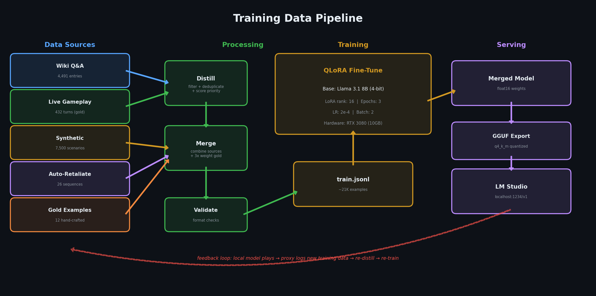
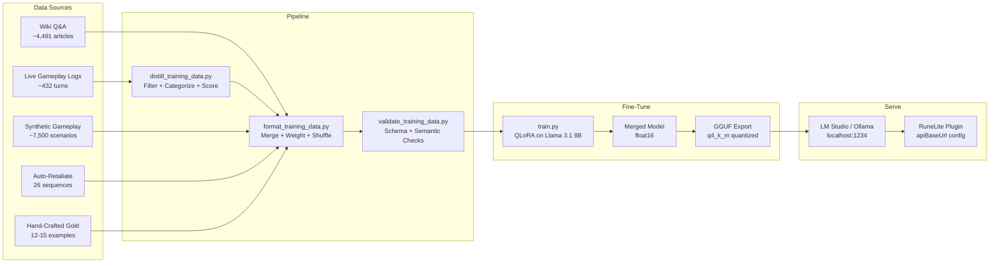

# Training Data Pipeline

How we distill Claude's gameplay into training data and fine-tune a local 8B model to play OSRS autonomously -- no API costs, no internet dependency.

## Overview

The goal is **knowledge distillation**: Claude (the teacher model) plays OSRS through the RuneLite plugin, and every successful turn is logged. We combine those logs with wiki knowledge, synthetic scenarios, and hand-crafted examples, then fine-tune a local Llama 3.1 8B model (the student) that can replace Claude entirely.

The fine-tuned model runs on consumer hardware (RTX 3080, 10GB VRAM) and serves an OpenAI-compatible API on localhost. The plugin does not know or care whether it is talking to Claude or the local model -- it just sends game state and receives JSON actions.



<details>
<summary>Mermaid source</summary>



</details>

## Data Sources

### 1. Wiki Q&A (`data/wiki_raw.jsonl` -- 4,491 articles)

OSRS wiki scraped into raw article text, then transformed into question-answer training pairs by `format_training_data.py`. Gives the model game knowledge: item stats, quest requirements, skill training methods, NPC locations, and shop inventories.

**Generation pipeline:**

| Step | Script | What it does |
|------|--------|--------------|
| 1 | `scrape_wiki.py` | Hits the `oldschool.runescape.wiki` API, pulls articles from ~30 categories (Items, Monsters, Quests, Skills, Locations, etc.), writes raw `{title, text}` JSONL |
| 2 | `compress_wiki.py` | Filters cosmetic/holiday items, strips Trivia/Gallery/References sections, trims minor articles to 500 chars, keeps full text for gameplay-critical articles. Outputs a compact `wiki_context.txt` for runtime context injection |
| 3 | `format_training_data.py` | Converts each article into 2+ Q&A pairs ("Tell me about X in OSRS", "What is X?", plus additional pairs for multi-section articles) |

Each wiki article produces roughly 2-3 training examples, yielding ~10,000-13,000 wiki Q&A pairs in the final training set.

### 2. Live Gameplay Logs (`data/gameplay_logs.jsonl` -- 432 entries)

Real game state to action pairs captured from the proxy's training log during actual Claude gameplay sessions. This is the gold standard -- these are verified successful turns where Claude read the game state, reasoned about what to do, and the actions executed without error.

**Generation:** `distill_training_data.py` reads `/tmp/training_turns.jsonl` (written by the proxy during live play), applies the filter pipeline described in [Distillation Filters](#distillation-filters), and outputs clean gameplay logs.

**Why so few?** Each entry is a real, verified, successful gameplay turn. Most raw turns get filtered out -- failed actions, stuck states, duplicate grinding loops, and unparseable responses are all rejected. Quality matters more than quantity here; these examples anchor the model's behavior on real gameplay patterns.

### 3. Synthetic Gameplay (`data/synthetic_gameplay.jsonl` -- 7,500 entries)

Generated scenarios that cover edge cases the bot rarely encounters naturally during live play. This is the bulk of gameplay training data.

**Generated by:** `generate_gameplay_data.py`

**Coverage:**
- All 39 action types exercised across varied contexts
- All 23 skills with appropriate game states (correct tools, locations, level requirements)
- Session notes chains (multi-step task planning)
- Death recovery (respawning, re-equipping, returning to activity)
- Quest dialogue trees and walkthroughs
- Full inventory management (banking, dropping, processing decisions)
- Combat edge cases (low HP, fleeing, food management, equipment switching)
- Shop/GE interactions
- Error recovery (adapting after failed actions)

### 4. Auto-Retaliate Training (`data/auto_retaliate_training.jsonl` -- 26 entries)

Targeted sequences that teach the `SET_AUTO_RETALIATE` action and its correct timing. Generated by `patch_autoret.py`, which patches synthetic combat examples to inject auto-retaliate state into the environment line and prepends the toggle action when needed.

**Logic:**
- Attack examples where AutoRet is OFF: prepends `SET_AUTO_RETALIATE "on"` before combat
- Flee examples where AutoRet is ON: prepends `SET_AUTO_RETALIATE "off"` before fleeing
- Includes reasoning text explaining why the toggle is needed

### 5. Hand-Crafted Gold Examples (`example_data.jsonl` -- 12-15 entries)

Manually written, pixel-perfect training examples that demonstrate ideal behavior for core gameplay loops. These serve as behavioral anchors -- the model sees exactly how a perfect turn should look.

**Covers:**
- Mining + smelting loop (mine ore, full inventory, walk to furnace, smelt)
- Woodcutting + banking loop (chop, bank, withdraw axe, return)
- Tutorial Island dialogue progression (hint arrows, NPC interaction, option selection)
- Fishing with error recovery (failed action, correct retry with proper option)
- Combat with HP management (monitoring health, eating food, fleeing when low)
- Banking sequences (deposit all, withdraw specific items, close bank)
- Multi-step pathfinding (chunked PATH_TO with re-issue on partial progress)

## Data Format

Every training example follows the same JSONL structure with a `conversations` array. This is the standard chat format expected by SFTTrainer and Llama's chat template.

```json
{
  "conversations": [
    {
      "role": "system",
      "content": "<system prompt with task description>"
    },
    {
      "role": "user",
      "content": "<serialized game state>"
    },
    {
      "role": "assistant",
      "content": "<reasoning text + JSON action array>"
    }
  ]
}
```

### Full Example (mining + navigation)

```json
{
  "conversations": [
    {
      "role": "system",
      "content": "You are an OSRS (Old School RuneScape) bot brain. You read game state and output JSON actions.\n\n## Your Task\nMine copper and tin ore at Lumbridge Swamp mine, then smelt bronze bars at the Al Kharid furnace.\n\n## Response Format\nYou MUST output a JSON array of 1-5 action objects. Brief reasoning before the array is allowed."
    },
    {
      "role": "user",
      "content": "[CURRENT_GOAL] Mine copper ore at Lumbridge Swamp\n[ACTION_RESULTS] Your previous actions:\n  1. INTERACT_OBJECT(Copper rocks/Mine) -> SUCCESS\n  2. WAIT_ANIMATION -> SUCCESS: Animation finished after 4 ticks\n[PLAYER] BotAccount42 | Combat:3 | HP:10/10 | Prayer:1/1 | Run:100% [ON] | Weight:4kg | SpecAtk:100% | Pos:(3230,3148,0)\n[STATUS] IDLE\n[SKILLS] Atk:1 Str:1 Def:1 Rng:1 Mag:1 WC:1 Mine:4 Fish:1 Cook:1 FM:1 Craft:1 Smith:1 Fletch:1 Slay:1 Farm:1 Con:1 Hunt:1 Agi:1 Thiev:1 Herb:1 RC:1\n[XP] Mine:340/388(87%)\n[INVENTORY] (5/28) Bronze pickaxe(x1) | Copper ore(x3) | Tin ore(x1)\n[EQUIPMENT] None\n[NEARBY_OBJECTS] Copper rocks(x2) nearest:pos(3229,3146) dist:2 [Mine] | Tin rocks pos:(3231,3147) dist:1 [Mine] | Rocks(x3) nearest:pos(3228,3147) dist:2 [Mine]\n[NEARBY_NPCS] Giant rat(lvl:1)(x2) nearest:pos(3225,3150) dist:5 [Attack]\n[ENVIRONMENT] Region:Lumbridge Swamp(12594) Plane:0 World:301 Tab:Inventory Style:Accurate Tick:4521\n[GAME_MESSAGES] You manage to mine some copper."
    },
    {
      "role": "assistant",
      "content": "Got another copper ore, now at 3 copper and 1 tin. I need equal amounts for bronze bars, so I should mine more tin to balance it out. Tin rocks are 1 tile away.\n[{\"action\": \"INTERACT_OBJECT\", \"name\": \"Tin rocks\", \"option\": \"Mine\"}, {\"action\": \"WAIT_ANIMATION\"}]"
    }
  ]
}
```

### Game State Sections

The user content (game state) is a structured text format produced by `GameStateSerializer.java`:

| Section | Description | Example |
|---------|-------------|---------|
| `[CURRENT_GOAL]` | The bot's current objective | `Mine copper ore at Lumbridge Swamp` |
| `[ACTION_RESULTS]` | Results from the previous turn's actions | `1. INTERACT_OBJECT(Copper rocks/Mine) -> SUCCESS` |
| `[PLAYER]` | Name, combat level, HP, prayer, run energy, position | `BotAccount42 \| Combat:3 \| HP:10/10 \| Pos:(3230,3148,0)` |
| `[STATUS]` | Current state | `IDLE`, `IN_COMBAT`, `MOVING`, `ANIMATING(id)` |
| `[SKILLS]` | All 21 skill levels (abbreviated) | `Atk:1 Str:1 Def:1 Mine:4 ...` |
| `[XP]` | Skills close to leveling (shown when >75%) | `Mine:340/388(87%)` |
| `[INVENTORY]` | Items with counts, capacity | `(5/28) Bronze pickaxe(x1) \| Copper ore(x3)` |
| `[EQUIPMENT]` | Worn items by slot | `Weapon:Iron scimitar \| Shield:Wooden shield` |
| `[NEARBY_OBJECTS]` | Interactable objects with positions and options | `Copper rocks(x2) nearest:pos(3229,3146) dist:2 [Mine]` |
| `[NEARBY_NPCS]` | NPCs with combat levels and options | `Giant rat(lvl:1)(x2) nearest:pos(3225,3150) dist:5 [Attack]` |
| `[NEARBY_GROUND_ITEMS]` | Dropped items on the ground | `Cowhide pos:(3252,3269) dist:1 qty:1 [Take]` |
| `[ENVIRONMENT]` | Region, plane, world, active tab, attack style, tick | `Region:Lumbridge Swamp(12594) Plane:0 World:301 Tick:4521` |
| `[GAME_MESSAGES]` | Recent chat/game messages | `You manage to mine some copper.` |
| `[DIALOGUE]` | Active NPC/option dialogue | `type:npc_continue speaker:"Gielinor Guide" text:"..."` |
| `[BANK_OPEN]` | Bank contents (when bank is open) | Item list with quantities |
| `[MAKE_INTERFACE_OPEN]` | Crafting/smelting interface items | Available items to make |
| `[HINT_ARROW]` | Tutorial hint arrow target | `npc -> Gielinor Guide at (3093,3108)` |

### Wiki Q&A Format

Wiki examples use a different system prompt and simpler user/assistant content:

```json
{
  "conversations": [
    {
      "role": "system",
      "content": "You are an expert on Old School RuneScape (OSRS). Answer questions accurately based on your knowledge of the game, including items, NPCs, quests, skills, locations, and game mechanics."
    },
    {
      "role": "user",
      "content": "Tell me about Bronze bar in OSRS."
    },
    {
      "role": "assistant",
      "content": "A bronze bar is a metal bar that can be created through the Smithing skill by smelting one copper ore and one tin ore together, requiring Smithing level 1..."
    }
  ]
}
```

## Distillation Filters

`distill_training_data.py` applies a multi-stage filter pipeline to raw gameplay turns before they become training data. The goal is aggressive quality filtering -- better to have 400 excellent examples than 2,000 mediocre ones.

### Filter Pipeline

```
Raw turns (/tmp/training_turns.jsonl)
  |
  +-- Exclusion list (purged turns from retroactive bug fixes)
  +-- Parse filter (response must contain valid JSON action array)
  +-- Empty action filter (must have at least 1 non-empty action)
  +-- All-WAIT filter (reject pure idle turns)
  +-- STUCK filter (reject turns where game state shows STUCK status)
  +-- Loop detection (same action sequence 3 consecutive turns = loop, reject)
  +-- Forward validation (next turn's ACTION_RESULTS must show all OK, no FAILED)
  +-- Last-turn filter (final turn in session has no next turn to verify, skip)
  |
  v
Accepted turns
  |
  +-- Categorization (mining, banking, combat, navigation, dialogue, skilling, etc.)
  +-- Priority scoring (high for strategic reasoning, goal changes, recovery)
  +-- Deduplication by (position + inventory size + action sequence) hash
  |
  v
Clean gameplay_logs.jsonl
```

### Category Rules

Each accepted turn is labeled with a category based on its action types and response content:

| Category | Trigger |
|----------|---------|
| `recovery` | Game state contains a `-> FAILED` action result and the LLM adapts |
| `mining` | `INTERACT_OBJECT` + keywords like "rock", "ore", "mine", "pickaxe" |
| `banking` | `BANK_DEPOSIT`, `BANK_WITHDRAW`, `BANK_CLOSE`, `BANK_DEPOSIT_ALL` |
| `combat` | `EAT_FOOD`, `SPECIAL_ATTACK`, or `INTERACT_NPC` + "attack"/"fight" |
| `navigation` | Only `PATH_TO`/`WALK_TO`/`MINIMAP_WALK` (+ `WAIT`/`TOGGLE_RUN`) |
| `dialogue` | `SELECT_DIALOGUE` or `CONTINUE_DIALOGUE` |
| `skilling` | `USE_ITEM_ON_ITEM`, `USE_ITEM_ON_OBJECT`, `MAKE_ITEM` |
| `shopping` | `SHOP_BUY`, `SHOP_SELL`, `GE_BUY`, `GE_SELL` |
| `equipment` | `EQUIP_ITEM` or `UNEQUIP_ITEM` |
| `general` | Anything that does not match the above |

### Priority Scoring

Turns are scored as `high` or `normal` priority. High-priority turns contain strategic reasoning, decision-making, or adaptation -- the interesting stuff, not the grinding.

| Priority Reason | Trigger |
|----------------|---------|
| `recovery_adaptation` | Category is `recovery` (LLM adapted to a failure) |
| `goal_change` | Response sets a new goal that is meaningfully different from `[CURRENT_GOAL]` (not just cosmetic rewording) |
| `equipment_change` | Actions include `EQUIP_ITEM` or `UNEQUIP_ITEM` |
| `shopping_decision` | Actions include shop or GE operations |
| `complex_action_set` | 3+ unique non-WAIT action types in one turn |
| `strategic_reasoning` | Reasoning text contains patterns like "switch to", "change goal", "need to first", "inventory full", "too dangerous", "step 1...then" |
| `nudge_response` | Game state contains `[USER_NUDGE]` (human redirected the bot) |

## Merge and Weight

`format_training_data.py` merges all sources into a single shuffled training file.

### Input Files

| Source | File | Examples |
|--------|------|----------|
| Wiki Q&A | `data/wiki_raw.jsonl` | ~4,491 articles -> ~10-13K Q&A pairs |
| Live Gameplay | `data/gameplay_logs.jsonl` | ~432 (after distillation) |
| Synthetic Gameplay | `data/synthetic_gameplay.jsonl` | ~7,500 |
| Auto-Retaliate | `data/auto_retaliate_training.jsonl` | 26 |
| Hand-Crafted Gold | `example_data.jsonl` | 12-15 |

### Weighting Strategy

High-priority gameplay examples (from distillation scoring) are **duplicated 3x** in the training set. This means the model sees goal changes, recovery adaptations, and strategic decisions three times as often as routine grinding turns.

```python
is_high = log_entry.get("priority") == "high"
repeat = 3 if is_high else 1
for _ in range(repeat):
    all_examples.append(example)
```

### Output

The merged file is shuffled with a fixed seed (`random.seed(42)`) for reproducibility and written to `data/train.jsonl`.

Current total: **~21,359 examples** (varies as new gameplay logs are added).

### Validation

Run `validate_training_data.py` on the output to check:

- **Format**: Valid JSON, correct `conversations` structure, correct role ordering (system/user/assistant)
- **Game state**: Required sections present (`[PLAYER]`, `[STATUS]`, `[SKILLS]`, `[INVENTORY]`, `[ENVIRONMENT]`)
- **Actions**: Valid action types, required fields present, reasonable coordinate/quantity ranges
- **Semantic**: Bank actions require `[BANK_OPEN]`, shop actions require `[SHOP_OPEN]`, `WAIT_ANIMATION` not after walking actions, no gathering with 28/28 inventory
- **Coverage**: Reports which of the 39 action types and 23 skills are represented

```bash
python3 validate_training_data.py data/train.jsonl
```

## Fine-Tuning Config

`train.py` fine-tunes using [Unsloth](https://github.com/unslothai/unsloth) + QLoRA for efficient consumer-GPU training.

### Model

| Parameter | Value | Notes |
|-----------|-------|-------|
| Base model | `unsloth/Meta-Llama-3.1-8B-Instruct-bnb-4bit` | Pre-quantized 4-bit, ~5GB download |
| Max sequence length | 4096 tokens | Fits game state (~1-2K tokens) + response (~200-500 tokens) |
| Quantization | 4-bit (bitsandbytes NF4) | QLoRA -- train LoRA adapters on quantized base |

### LoRA Configuration

| Parameter | Value | Notes |
|-----------|-------|-------|
| Rank (r) | 16 | Higher = more capacity, more VRAM. 16 is a good balance |
| Alpha | 16 | Set equal to rank (effective scaling = alpha/rank = 1.0) |
| Dropout | 0 | Unsloth-optimized, keep at 0 |
| Target modules | `q_proj, k_proj, v_proj, o_proj, gate_proj, up_proj, down_proj` | All attention + MLP layers |
| Gradient checkpointing | `"unsloth"` | 30% less VRAM than standard checkpointing |

This results in ~0.5-1% of parameters being trainable (~40M out of ~8B).

### Training Hyperparameters

| Parameter | Value | Notes |
|-----------|-------|-------|
| Batch size | 2 | Per-device. Reduce to 1 if CUDA OOM |
| Gradient accumulation | 4 | Effective batch size = 8 |
| Epochs | 3 | Three passes over the data |
| Learning rate | 2e-4 | Standard for LoRA fine-tuning |
| Warmup steps | 10 | Brief warmup |
| Optimizer | AdamW 8-bit | 8-bit Adam saves ~2GB VRAM |
| Precision | bf16 | RTX 3080 supports bfloat16 with recent CUDA |
| Packing | Off | Disabled to avoid issues with variable-length examples |
| Save strategy | Per epoch | Checkpoint after each epoch |

### Hardware Requirements

| Component | Minimum | Recommended |
|-----------|---------|-------------|
| GPU | RTX 3060 (12GB) | RTX 3080 (10GB) / RTX 4070+ |
| RAM | 16GB | 32GB |
| Disk | 20GB free | 50GB free (model + checkpoints + GGUF) |
| Time | ~2-4 hours | ~1-2 hours (on RTX 3080) |

### Output

The training script produces two outputs:

1. **Merged model** (`output/merged/`): Full float16 model with LoRA weights merged into the base. Used if you want to run with transformers directly.
2. **GGUF export** (`output/gguf/`): Quantized to `q4_k_m` for llama.cpp / LM Studio / Ollama. This is the file you actually deploy. Typically ~4-5GB.

```bash
# Full pipeline
cd osrs-llm
python3 format_training_data.py   # merge all sources -> data/train.jsonl
python3 validate_training_data.py data/train.jsonl  # check for errors
python3 train.py                  # fine-tune (~2 hours on RTX 3080)
# Output: output/gguf/*.gguf
```

## Serving

The fine-tuned GGUF model runs locally via LM Studio, Ollama, or any OpenAI-compatible server.

### LM Studio (recommended)

1. Copy the `.gguf` file from `output/gguf/` into LM Studio's models directory
2. Load the model in LM Studio
3. Start the local API server (default: `http://localhost:1234/v1`)
4. In the RuneLite plugin config, set `apiBaseUrl` to `http://localhost:1234/v1`
5. Leave `apiKey` empty (or set to any value -- local servers ignore it)

### Ollama

```bash
# Create a Modelfile
echo 'FROM ./output/gguf/your-model.gguf' > Modelfile
ollama create osrs-bot -f Modelfile
ollama serve  # starts on localhost:11434

# Plugin config: apiBaseUrl = http://localhost:11434/v1
```

### Performance

| Metric | Claude API | Local 8B (q4_k_m) |
|--------|-----------|-------------------|
| Inference latency | ~1-3s (network + generation) | ~100-300ms |
| Cost per turn | ~$0.003-0.01 | $0 |
| Quality (common tasks) | Excellent | Good-to-excellent (with enough training data) |
| Quality (novel situations) | Excellent | Degrades on unseen scenarios |
| Privacy | Data sent to API | Fully local |

The plugin's `apiBaseUrl` config makes the switch transparent. When the field is empty, the plugin talks to the Anthropic API. When set to a local URL, it talks to the local model. No code changes required.

## Dataset Size Guidelines

How much training data do you need? Rough benchmarks from our experiments:

| Examples | Quality Level | What the model learns |
|----------|--------------|----------------------|
| ~100 | Minimal | Outputs valid JSON action arrays. Gets the format right but makes poor decisions |
| ~500 | Decent | Handles common tasks (mining, woodcutting, banking). Struggles with multi-step plans |
| ~1,000 | Good | Solid general performance. Correct pathfinding decisions, proper food management, handles most skilling loops |
| ~5,000 | Very good | Handles edge cases (death recovery, quest dialogues, GE trading). Strategic reasoning appears in responses |
| ~10,000+ | Excellent | Approaches Claude-level on trained scenarios. Wiki knowledge allows answering game mechanic questions in reasoning |
| ~20,000+ (current) | Production | Covers all 39 action types, all 23 skills, error recovery, and strategic planning. Diminishing returns beyond this without more diverse live gameplay |

The wiki Q&A data (~10-13K examples) provides breadth of game knowledge. The gameplay data (~8K synthetic + live) provides depth of decision-making. The combination is what makes the model functional -- game knowledge alone does not teach action selection, and action examples alone do not teach the model why those actions are correct.

### Growing the Dataset

The most impactful way to improve the model is to collect more **live gameplay logs**. Each hour of Claude playing OSRS produces roughly 50-100 new training turns after distillation. Run the bot with Claude on diverse tasks (different skills, quests, locations), then re-run the pipeline:

```bash
# After a gameplay session:
python3 distill_training_data.py --dedup          # filter new turns
python3 format_training_data.py                    # re-merge everything
python3 validate_training_data.py data/train.jsonl # sanity check
python3 train.py                                   # re-train
```

The distillation script appends to `gameplay_logs.jsonl` and deduplicates across runs, so you can incrementally grow the dataset over many sessions.
